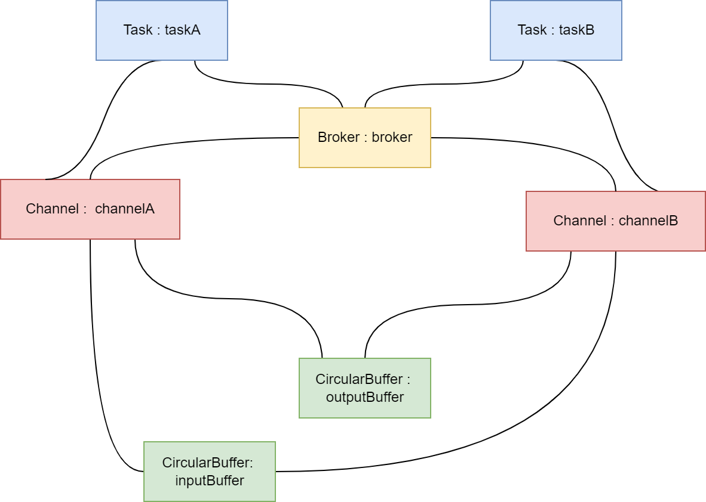

# DM 1 : Designing complex systems 

Individually, in your own words, write down the specification for the following
communication framework, as seen in the lecture. 

In this case, the specification is what a developer needs to know in order to be
able to use this framework.

Also write a sample code that illustrate the basics: create a channel and send 
and receive something, like a string "Hello World" for example.

Once it is done, before the next lecture (21/09/2022),
do a git-add/git-commit, with the commit message "Channel Specification"

The given classes, written in Java:

```Java
  public class Broker {
    public Broker(String name) {}
    public Channel accept(int port) { return null; }
    public Channel connect(String name, int port) { return null; }
  }

  public class Channel {
    public int read(byte[] bytes, int offset, int length) { return 0; }
    public int write(byte[] bytes, int offset, int length) { return 0; }
    public void disconnect() {}
    public boolean disconnected() { return false; }
}
```

## Spécifications 

- Le channel est bidirectionnel, il permet de lire et d'écrire des octets 
- La méthode `read()` permet de lire les octects du buffer **bytes**. Cette méthode est bloquante quand il n'y a aucun octet à lire
- La méthode `read()` renvoie le nombre d'octets lus 
- La méthode `write()` écrit les octets dans le buffer et renvoie le nombre d'octets écrits
- La méthode `write()` envoie les octets en flots, elle est FIFO et sans perte (loseless)
- La méthode `accept()` autorise les connexions sur un port donné en générant un nouveau channel de communication. Elle est bloquante en attente d'éventuelles connexions. 
- La méthode `connect()` permet de se connecter à un Broker dont le nom et le port sont connus en générant un nouveau channel. C'est une méthode bloquante en attente des autorisations de connexion


## Conception 

- La communication est réalisée en utilisant deux objets de la classe Task. 
- Les deux instances Task possède un objet Broker commun. 
- La première tâche autorise des connexions sur un port donné en utilisant la méthode `accept(port)` du broker, et est bloquée jusqu'à la prochaine connexion
- La deuxième tâche se connecte en utilisant le nom et le numéro de port de la connexion ouverte précédemment 
- Un objet Channel est associé à chaque tâche, soit deux instances Channel au total. 
- Les deux instances de la classe Channel se partagent deux buffers croisés correspondant à des instances de la classe CircularBuffer


*Fig : Diagramme d'objets*


## Implémentation

Voir le code dans le dossier broker_channel


 
